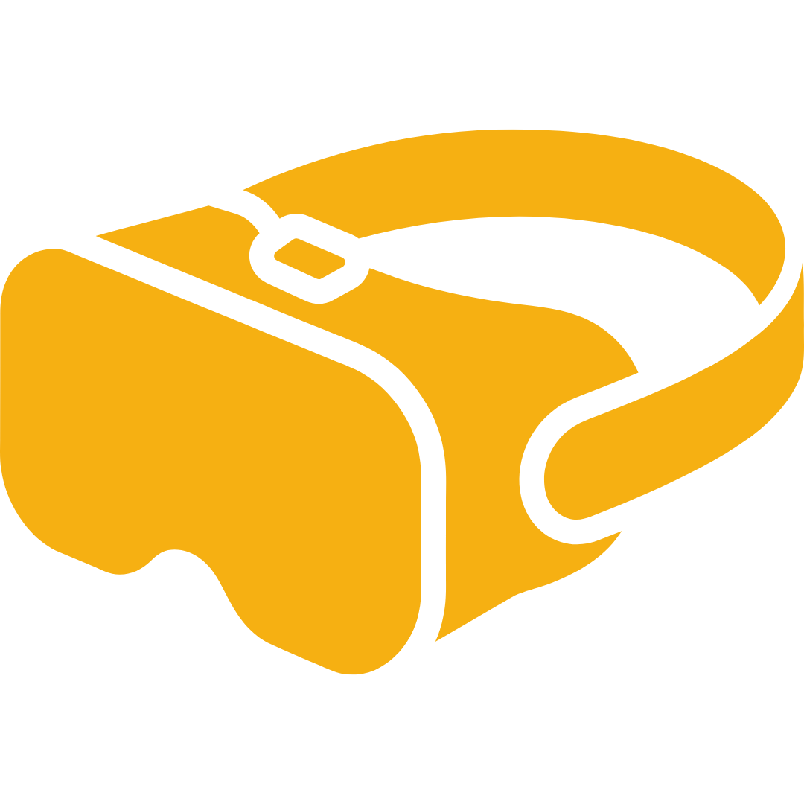

<h1 align="center">forge</h1>

<h3 align="center">a modern, feature-rich quest VR game manager with a focus on organization, efficiency, and a premium user experience.</h3>

  

  <strong>organize, download, and install quest vr games with style</strong>

<h2 align="center">features</h2>

<h3 align="center">game library management</h3>

- **collections & favorites** — organize games into custom collections with colors (horror, puzzle, must play, etc.) and mark favorites with a single click
- **smart filtering** — filter by all, favorites, installed, updates available, or any custom collection
- **batch operations** — select multiple games with checkboxes, then download, install, or uninstall them all at once
- **virtual scrolling** — smooth performance even with thousands of games

<h3 align="center">keyboard-first experience</h3>

<table>
  <thead>
    <tr><th>shortcut</th><th>action</th></tr>
  </thead>
  <tbody>
    <tr><td><code>ctrl+f</code></td><td>focus search</td></tr>
    <tr><td><code>ctrl+d</code></td><td>toggle downloads drawer</td></tr>
    <tr><td><code>ctrl+u</code></td><td>toggle uploads drawer</td></tr>
    <tr><td><code>ctrl+,</code></td><td>open settings</td></tr>
    <tr><td><code>ctrl+1</code></td><td>switch to games view</td></tr>
    <tr><td><code>ctrl+r</code></td><td>refresh game list</td></tr>
    <tr><td><code>escape</code></td><td>close drawers/dialogs</td></tr>
  </tbody>
</table>

<h3 align="center">device integration</h3>

- **wireless ADB** — connect to your quest over wifi
- **wifi bookmarks** — save frequently-used device connections
- **real-time status** — see battery level, storage usage, and connection status at a glance

<h3 align="center">uploads + downloads</h3>

- **slide-out drawers** — quick access to download/upload queues without leaving the games view
- **progress tracking** — live download speed, ETA, and extraction progress
- **queue management** — pause, resume, retry, or cancel downloads

<h3 align="center">mirror system</h3>

- **custom mirrors** — add your own rclone-based mirrors
- **mirror testing** — test connectivity and latency before use
- **automatic failover** — falls back to working mirrors if one fails

<h3 align="center">premium dark theme</h3>

- **solid dark backgrounds** — `#050505` base for comfortable extended use
- **warm color palette** — yellow (`#f6b012`) accents with blue (`#3c9fdd`) info colors
- **smooth animations** — polished micro-interactions throughout
- **collapsible settings** — clean, organized UI with expandable sections

<h2 align="center">comparison</h2>

<table>
  <thead>
    <tr><th>feature</th><th>forge VR</th><th>sidequest</th><th>rookie</th></tr>
  </thead>
  <tbody>
    <tr><td>game collections</td><td>✅</td><td>❌</td><td>❌</td></tr>
    <tr><td>batch operations</td><td>✅</td><td>❌</td><td>❌</td></tr>
    <tr><td>keyboard shortcuts</td><td>✅</td><td>❌</td><td>❌</td></tr>
    <tr><td>custom mirrors</td><td>✅</td><td>❌</td><td>✅</td></tr>
    <tr><td>wireless ADB</td><td>✅</td><td>✅</td><td>✅</td></tr>
    <tr><td>modern dark UI</td><td>✅</td><td>✅</td><td>❌</td></tr>
    <tr><td>open source</td><td>✅</td><td>❌</td><td>❌</td></tr>
  </tbody>
</table>

<h2 align="center">installation</h2>

<h3 align="center">requirements</h3>

- windows 10/11, macOS, or linux
- meta quest headset (quest 1, 2, 3, or pro)
- USB cable or wifi connectivity (quest must have developer mode enabled)

<h3 align="center">download</h3>

download the latest release for your platform from <a href="https://github.com/houseofmates/forge-vr/releases">releases</a>:

<table>
  <thead>
    <tr><th>platform</th><th>file</th></tr>
  </thead>
  <tbody>
    <tr><td>windows</td><td><code>forge-vr-x.x.x-setup-x64.exe</code></td></tr>
    <tr><td>macOS (apple silicon)</td><td><code>forge-vr-x.x.x-arm64.dmg</code></td></tr>
    <tr><td>macOS (intel)</td><td><code>forge-vr-x.x.x-x64.dmg</code></td></tr>
    <tr><td>linux</td><td><code>forge-vr-x.x.x-x64.AppImage</code></td></tr>
  </tbody>
</table>

<h3 align="center">quick start</h3>

1. **connect** your quest via USB (enable developer mode first)
2. **launch** forge VR — your device will be detected automatically
3. **browse** games, use collections to organize, download, and install!

<h2 align="center">macOS notes</h2>

since the application is not signed by an apple developer ID, you may see: "forge VR is damaged and can't be opened."

to resolve this, run in terminal:

<pre align="center"><code>xattr -c /Applications/Forge\ VR.app
</code></pre>

<h2 align="center">logs</h2>

log files are stored at:

- **linux:** `~/.config/forge-vr/logs/main.log`
- **macOS:** `~/Library/Logs/forge-vr/main.log`
- **windows:** `%USERPROFILE%\AppData\Roaming\forge-vr\logs\main.log`

you can also upload logs directly from settings for support.

<h2 align="center">troubleshooting</h2>

<h3 align="center">device not detected</h3>

1. enable developer mode on your quest (settings → system → developer)
2. allow USB debugging when prompted on headset
3. try a different USB port/cable
4. restart ADB: `adb kill-server && adb start-server`

<h3 align="center">wifi connection issues</h3>

1. ensure quest and PC are on the same network
2. check that port 5555 is not blocked by firewall
3. try connecting via USB first, then switch to wifi

<h3 align="center">network/DNS issues</h3>

if you see connectivity errors:

1. **change DNS** — try cloudflare (1.1.1.1) or google (8.8.8.8)
2. **use a VPN** — protonVPN or 1.1.1.1 VPN (both free)
3. **check firewall** — whitelist required domains

<h2 align="center">development</h2>

<h3 align="center">prerequisites</h3>

- [node.js 18+](https://nodejs.org/)
- npm or pnpm

<h3 align="center">setup</h3>

<pre align="center"><code># clone the repository
git clone https://github.com/houseofmates/forge-vr.git
cd forge-vr

# install dependencies
npm install

# start development server
npm run dev
</code></pre>

<h3 align="center">build</h3>

<pre align="center"><code># build for current platform
npm run build

# build for specific platforms
npm run build:win
npm run build:mac
npm run build:linux
</code></pre>

<h3 align="center">commands</h3>

<table>
  <thead>
    <tr><th>command</th><th>description</th></tr>
  </thead>
  <tbody>
    <tr><td><code>npm run dev</code></td><td>start with hot reload</td></tr>
    <tr><td><code>npm run build</code></td><td>build for current platform</td></tr>
    <tr><td><code>npm run typecheck</code></td><td>typescript type checking</td></tr>
    <tr><td><code>npm run lint</code></td><td>run ESLint</td></tr>
    <tr><td><code>npm run format</code></td><td>format with prettier</td></tr>
  </tbody>
</table>

<h2 align="center">technology</h2>

built with:

- **electron** — cross-platform desktop framework
- **react 19** — UI library
- **fluent ui v9** — microsoft's design system (customized with PKM theme)
- **tanstack table** — performant virtualized data tables
- **ADB** — android debug bridge for device communication
- **rclone** — cloud storage downloads

<h2 align="center">contributing</h2>

contributions are welcome! please:

1. fork the repository
2. create a feature branch (`git checkout -b feature/amazing-feature`)
3. commit your changes (`git commit -m 'Add amazing feature'`)
4. push to the branch (`git push origin feature/amazing-feature`)
5. open a pull request

<h2 align="center">credits</h2>

- based on [apprentice VR](https://github.com/jimzrt/apprenticeVr) by jimzrt
- original was inspired by [rookie sideloader](https://github.com/VRPirates/rookie)
- icons from fluent UI Icons

<h2 align="center">license</h2>

this project is provided as-is. please respect the original project's licensing terms.

  <strong>forge</strong> — craft your perfect vr library.

  made with care for the quest community

